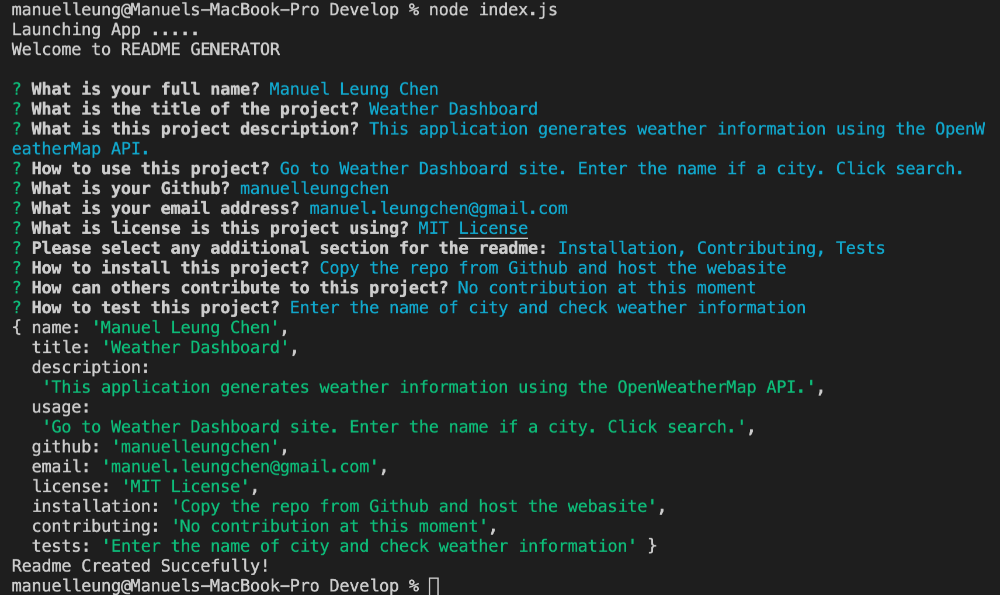

    
# README Generator


## Description  
This application generates a Readme file based on user input from the command line. The command line input prompted are created uisng the npm module [Inquirer](https://www.npmjs.com/package/inquirer).


    
## Table of Contents   
* [Installation](#installation)
* [Usage](#usage)
* [Credits](#credits)
* [License](#license)
* [Contributing](#contributing)
* [Tests](#tests)
* [Questions](#questions)

## Installation
1. Clone the repo.
2. Navigate to the project directory.
3. Run command ```npm install``` to install any dependencies.

## Usage    
* Navigate to the project directory.
* Enter command ```node index.js``` to run the script
* Answer each question when prompted.
* Check the created README file

For more details, please follow the [Demo Video](https://www.youtube.com/watch?v=F2rlYD83XtY)

## Credits  
Developed by: 
Manuel Leung Chen [GitHub](https://github.com/manuelleungchen)

Tools used: 
[npm module Inquirer](https://www.npmjs.com/package/inquirer)

## License
Copyright (c) 2020 - Manuel Leung Chen

Licensed under the [MIT License](https://choosealicense.com/licenses/mit/).
 
## Contributing
Comming Soon

## Tests
Comming Soon

## Questions
Manuel Leung Chen - [GitHub](https://github.com/manuelleungchen )

If you have any question about this application, please reach out me by [Email](manuel.leungchen@gmail.com)

